[INGRESO A APLICACIÓN 3](#ingreso-a-aplicación)

[PANTALLA PRINCIPAL 3](#pantalla-principal)

[Cargar Archivo 4](#cargar-archivo)

[Ordenar 6](#ordenar)

[GENERAR REPORTE 8](#generar-reporte)

[Requisitos de software: 10](#requisitos-de-software)

[Requisitos Mínimos 11](#requisitos-mínimos)

# 

# INGRESO A APLICACIÓN

Esta aplicación corre a través de un emulador, el emulador a utilizar es DOSBOX, se debe instalar este emulador previo a ejecutar la aplicación. Al tener instalado DOSBOX se procede a abrir e ingresar como se muestra a continuación:

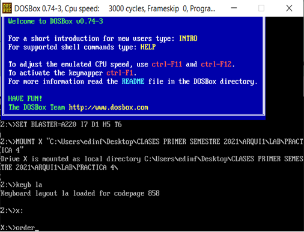

Al ingresar la palabra order(este nombre es del archivo .exe), automáticamente se mostrara la aplicación con todas las opciones que cuenta.

# PANTALLA PRINCIPAL

En esta pantalla se encuentra todas las opciones que cuenta esta aplicación para ordenar números

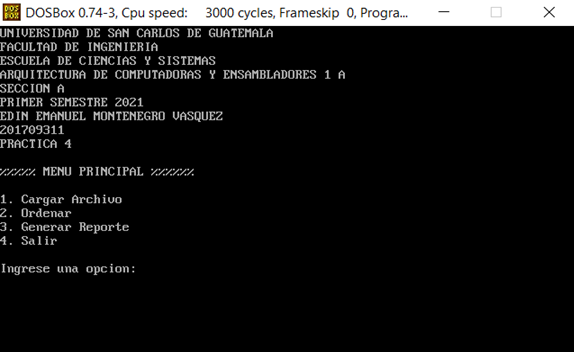

Como se puede observar cuenta con 4 opciones las cuales se detallan a lo largo de este documento, para seleccionar una opción se debe digitar el numero que previamente le acompaña a cada opción.

# Cargar Archivo

Esta funcionalidad nos permite la carga de un archivo que contiene una serie de números, de dos cifras los cuales deben estar en un fichero con extensión xml, en la pantalla nos mostrara un mensaje donde se debe ingresar la ruta del archivo, como se muestra a continuación:

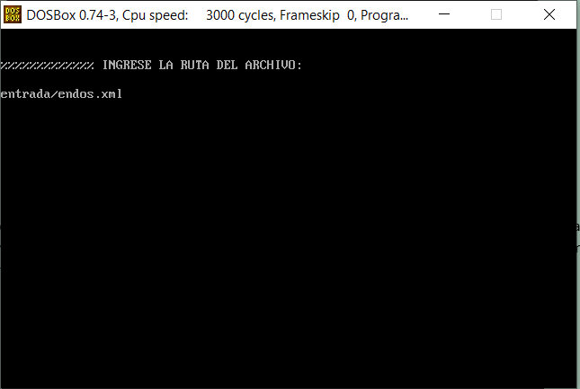

Como se puede observar se ingreso el nombre del archivo con una extensión, en esta pantalla se ingeso la extensión ".xml" luego de esto se debe presionar enter para poder acceder a este archivo

A continuación se muestra el diseño de un archivo que este programa es capaz de leer y obtener la información:

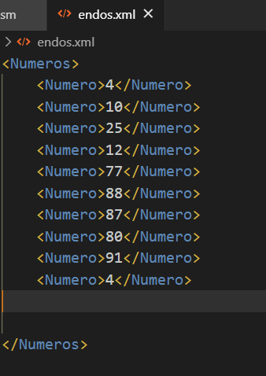

Se procede a ingresar este archivo para leer su contenido y guardarlo.

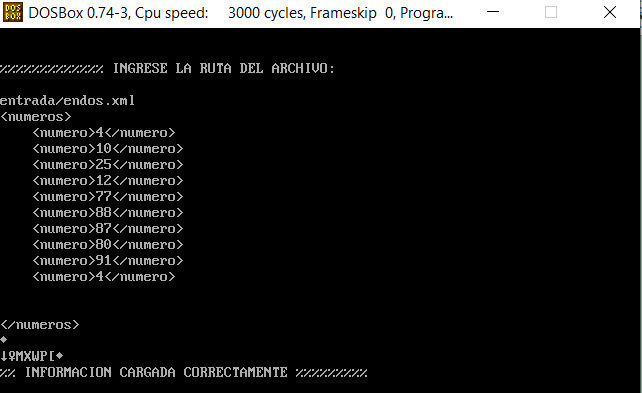

Si todo fue bien en la lectura y almacenamiento de la información se despliega el mensaje de "INFORMACION CARGADA CORRECTAMENTE", para poder ver su resultado debemos acceder a la opción de CREAR REPORTE de la cual se habla más adelante.

# Ordenar

Esta funcionalidad nos permite ingresar a ordenar los numeros que previamente fueron cargados desde la opción de carga de archivo, al seleccionar esta opción, se muestra la siguiente pantalla:

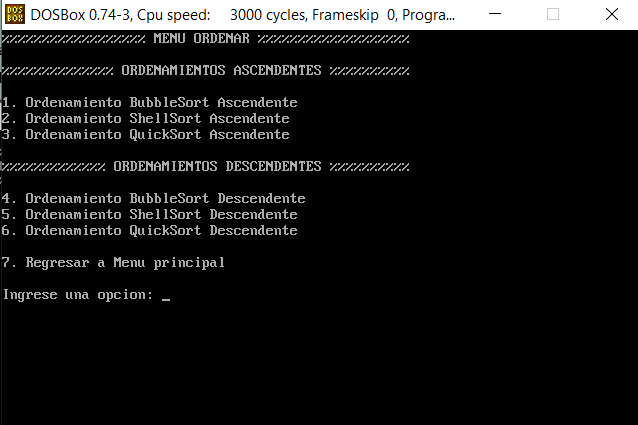

Como se puede observar nos muestra dos grupos de opciones, ordenamientos ascendentes y ordenamientos descendentes, para seleccionar solo se debe digitar el numero que previamente acompaña al ordenamiento deseado, en este manual se seleccionara la opción 3 y al seleccionarla se tiene la siguiente pantalla:

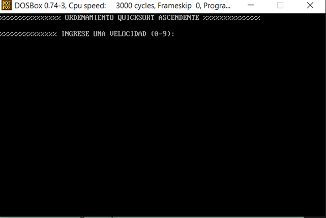

Ahora nos indica que ingresemos una velocidad, esta velocidad sirve para la animación grafica en el modo video, siendo la mas lenta el numero "0" y la mas rápida el numero "9", luego de ingresar la velocidad, se mostraran los números desordenados de la siguiente manera:

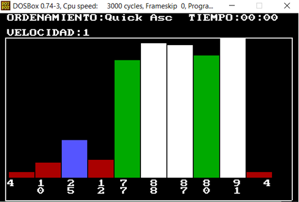

Como se puede observar nos muestra en pantalla el tipo de orden seleccionado, la velocidad y el tiempo, para empezar el ordenamiento se debe de presionar la barra espaciadora y el tiempo empezara a transcurrir, luego que haya finalizado el ordenamiento, se tendrá la siguiente pantalla:

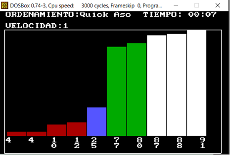

Como se pude observar los números han sido ordenados y el tiempo que se tardo fue 7 segundos, cuando el ordenamiento ah finalizado se debe presionar la tecla "ESC" para regresar al menú de ordenamiento

# GENERAR REPORTE

Esta funcionalidad nos ayuda ah obtener el historial de ordenamientos que se han realizado, el historial se guarda en un archivo con extensión .xml con el nombre de reporte en la carpeta del programa. Al ingresar a esta opcion se mostrara la siguiente pantalla:

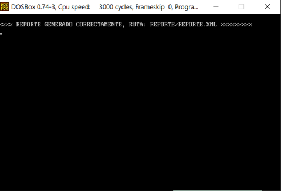

El reporte tiene el siguiente aspecto:

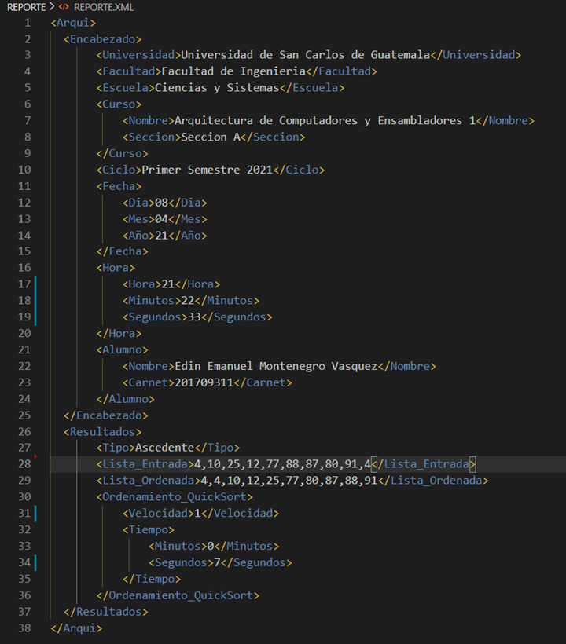

# Requisitos de software:

Para poder correr este programa debe de instalar previamente el emulador llamado DOSBOX e instalar macro assembler

Al instalarlos ingrese a dosbox y coloque lo siguiente:

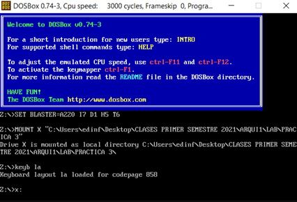

Luego presionar enter y asi podra ingresar a la aplicación.

# Requisitos Mínimos

Windows 10(versión minina 1903)

1 gb ram

100 mb de almacenamiento en HDD
